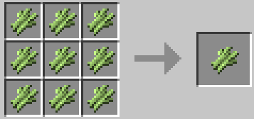
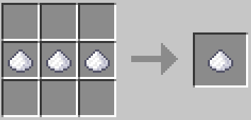
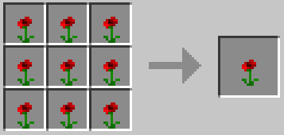
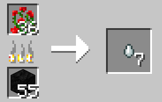

# Recipes
## Cocaine
First of all you will need to create a cocaine plant, you will need 9 sugar cane to obtain 
1 cocaine plant.  

Then you will need to plant the cocaine plant and wait until it grows, the time for this is the same as
normal sugar cane.

When harvesting the cocaine plant, there is a 10% chance of cocaine dust being dropped 
and a 40% chance of the cocaine plant being dropped.

To make cocaine, you will need 3 pieces of cocaine dust placed next to each other in the crafting table.
  

## Heroin
For heroin you will need to make a heroin seed, you can get this by putting 9 poppies in a 
crafting table.

Then you will need to plant the heroin seed and wait for it to grow.  
You will know that it is done when the poppy has turned into a rose bush, this takes about 15 to
20 minutes. 

When you break the rose bush, there is a 20% chance of it dropping a heroin plant and a 60% chance
of it dropping a heroin seed.

Once you have received a heroin plant, you put it in a furnace and wait one minute for it to cook the 
heroin.  

